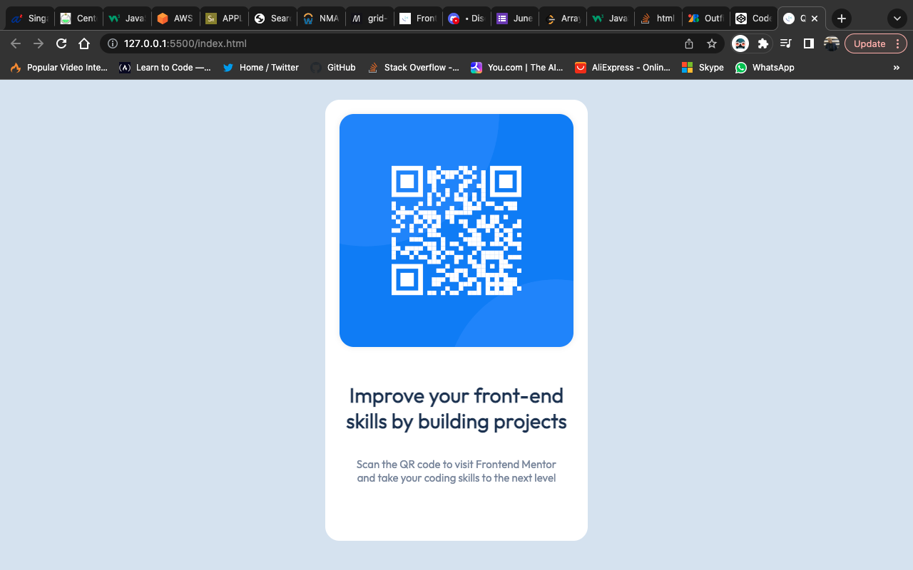

# QR code component solution

This is a solution to the QR code component challenge on Frontend Mentor.

## Overview

### Screenshot

### Continued development

I used a desktop-first approach, instead of mobile-first. I couldn't resize properly, so I'll be back for modification. 

Update: I solved it. 
